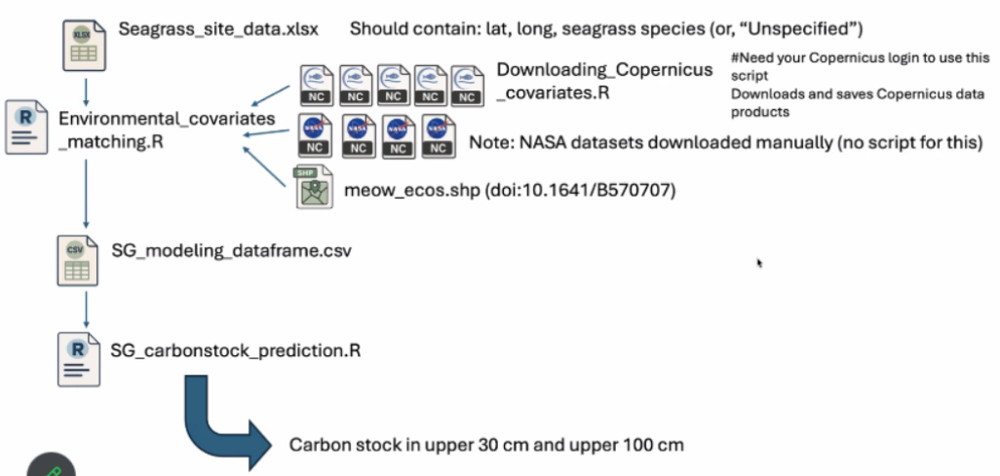
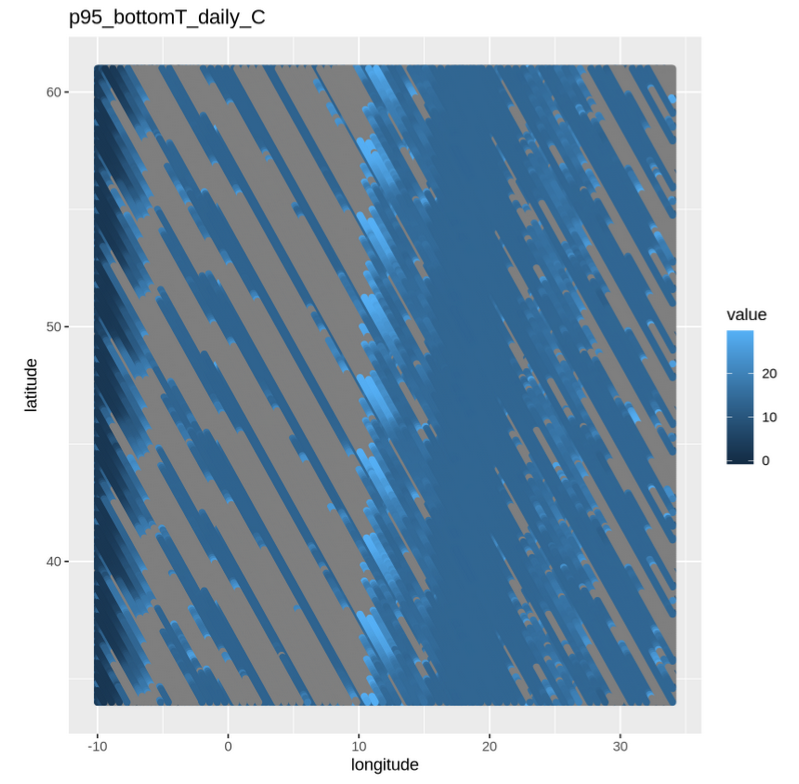

# Seagrass_carbon_stock_model

_TO Add **Short explanation of the aim of the workflow**_

## Introduction

The seagrass carbon stock model was developed to bring in relevant environmental data for modeling carbon stock as a function of environmental co-variates from remote sensing and Copernicus data products.

To run the model, it contains two steps: 
1. Extract closest values of the matching sites.
2. Predicet carbon stock at the sites.

## Data preparation

### The seagrass species in Europ.

* Cymodocea nodosa  
* Halophila stipulacea  
* Posidonia oceanica  
* Zostera marina  
* Zostera noltei  
* Zostera marina and Cymodocea nodosa  
* Zostera marina and Zostera noltei  

### The list of input datasets

* 95th percentile of bottom temperature (°C), 
* Eastward seawater velocity (m s-1), 
* Northward seawater velocity (m s-1), 
* Phosphate at sub surface depth 1.5 m (mmol m-3), 
* PH at sub surface depth 1.5 m (1), 
* Sea surface wave significant height (m), 
* Surface downward flux of total CO2 (molC m-2 yr-1), 
* Diffuse attenuation coefficient at 490 nm, 
* Remote sensing reflectance at 443 nm,

Example of 95th percentile of bottom temperature data

