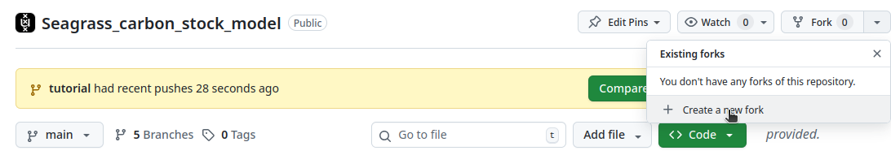
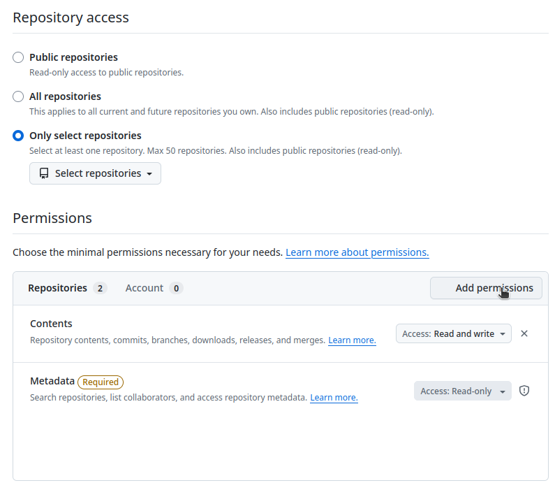
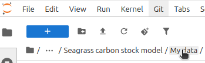
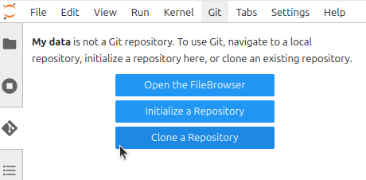

# Seagrass_carbon_stock_model

_[Short explanation of the aim of the workflow]_

### Running the workflow in NaaVRE
To run the workflow, you need to open the virtual lab in NaaVRE. If you are not in NaaVRE, click the link to the virtual lab (https://beta.naavre.net/vreapp/vl/blue-carbon) and press "_Launch my instance_".  
Once in NaaVRE, do the following:

#### Prepare an access key on MinIO
This virtual lab uses MinIO to upload the data that will be analyzed and store the results of the workflow. You can log into MinIO at https://scruffy.lab.uvalight.net:9001 using the same credentials as you're using to log into NaaVRE. In order to store and retrieve data from MinIO, you will need an access key. Create an access key [in MinIO](https://scruffy.lab.uvalight.net:9001/access-keys). Make sure to store the access key and secret key.

> **_Upcoming Feature:_**  An upcoming feature in NaaVRE will make the generation of the MinIO secret unnecessary.

#### Run the workflow for the default geospatial location
1) Open the workflow file: _[Add link to workflow file]()_.

> **_Tip:_**  Optionally you can drag the window next to this readme window to view both at the same time.

2) Press "Run"

3) Press "Use default parameter values". 

4) Fill in the email address you've used to log into NaaVRE in the field _param_user_email_. This should be the same e-mail address you see on MinIO.

5) Fill in the MinIO access key and secret key you've just generated in **Prepare an access key on MinIO**.

6) Press "Run".

7) Follow the link to the workflow execution view in Argo workflow, or open your workflow here: https://staging.demo.naavre.net/argowf/workflows by finding the workflow that has your e-mail address.

8) Once the workflow has succeeded, the results from the workflow are stored in MinIO.

#### Retrieve the output data
In the file browser, go to _Cloud storage -> naa-vre-user-data_.

Here you should see a results file from you workflow.

You can download the file by doing right click, then press download.

#### Run the workflow for any European location and a seagrass species
You can run this carbon stock model for any European location for various seagrass species. 
To do this, first copy the desired seagrass species option from the following list:

- Cymodocea nodosa  
- Halophila stipulacea  
- Posidonia oceanica  
- Zostera marina  
- Zostera noltei  
- Zostera marina and Cymodocea nodosa  
- Zostera marina and Zostera noltei  

Then, follow the steps described in the paragraph **Run the workflow in NaaVRE for the default geospatial location**, but fill in your own desired latitude, longitude, and paste the species option copied from the life above.

#### Inspecting the source code
You can look at the source code available in this virtual lab: _[/codebase/FILENAME]()_. 

#### Adapting the workflow for your own needs
You can adapt the workflow in NaaVRE to suit your own research objectives. To do this:

1) Create a fork of the git: https://github.com/QCDIS/Seagrass_carbon_stock_model/

2) On Github, create a fine grained personal access token for your repository: https://github.com/settings/personal-access-tokens/new . The permissions need to be set to _Read and Write access_ for _Contents_.

3) In the file browser, go to _Virtual Labs -> Seagrass carbon stock model -> My data_

4) Go to _Git_ in NaaVRE, press _Clone a repository_.

5) Enter the url of your forked repository.  

You a now free to change the virtual lab as necessary.
