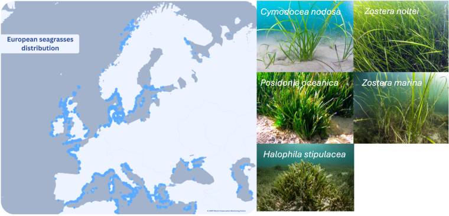
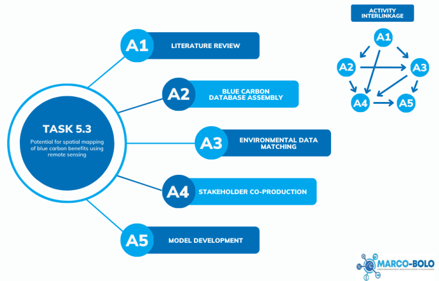

# Spatial mapping of blue carbon benefits

**Question**:
* Which **environmental variables** have the most robust statistical relationships with carbon storage in seagrass beds?
* How well can this combination of environmental variables **predict seagrass carbon storage** for the European region?

<div style="display: inline-block">

|    |    |    |
| -- | -- | -- |
| Author    | Natalya D. Gallo       | [Norwegian Research Center AS (NORCE)](https://www.norceresearch.no/en/) |
| Developer | Quan Pan, Koen Greuell | [LifeWatch ERIC](https://www.lifewatch.eu/) |
| Reference | Deliverable 5.3        | [MARCO-BOLO Project](https://marcobolo-project.eu/) |

</div>

## Introduction

### What is Blue Carbon?

The term “blue carbon” was defined as the carbon captured and stored by coastal and marine ecosystems dominated by rooted vegetation.

Over time, the definition of blue carbon has evolved.
The Intergovernmental Panel on Climate Change (IPCC), in its Sixth Assessment Report (AR6), defines blue carbon more broadly as 
“**biologically driven carbon fluxes and storage in marine systems that are amenable to management**” ([IPCC, 2022](https://doi.org/10.1017/9781009325844.029)). 

### A focus on seagrass ecosystems

Mangroves, seagrass meadows, and salt marshes are vegetated coastal habitats recognized for their remarkable ability to 
sequester and store atmospheric carbon dioxide (CO₂) in both their biomass and underlying sediments. 

Despite covering a relatively small fraction of the Earth’s surface, 
these ecosystems account for disproportionately high rates of carbon burial,
making them critical components in the global carbon cycle and highly relevant to climate change mitigation strategies. 

**We have decided** to focus on seagrass meadows because less work has been done on
valuation of carbon stocks in seagrasses compared to mangroves 
and they are more relevant for the European context.

> Ecologically, seagrass meadows are considered one of the most productive and valuable marine ecosystems
> ([Hemminga & Duarte, 2000](http://dx.doi.org/10.1017/CBO9780511525551)).

> Seagrasses provide a broad range of ecosystem services
> (e.g., carbon sequestration, coastal protection through wave energy attenuation, water quality improvement, biodiversity support, fisheries enhancement)
> and contribute to food security for many coastal communities
> ([Ondiviela et al., 2014](https://doi.org/10.1016/j.coastaleng.2013.11.005)). 



## Methods

Five key activities were undertaken:
* **A1** Literature review
* **A2** Blue carbon database assembly
* **A3** Environmental data matching to pair carbon-relevant larges-cale oceanographic data products with in-situ seagrass organic carbon measurements
* **A4** Coproduction activities with relevant stakeholders
* **A5** Model development and testing for estimating seagrass blue carbon stocks



## Results

### What variables affect carbon storage in seagrass beds?

Seagrass ecosystems store organic carbon in both aboveground and belowground components. 
* **Aboveground** biomass includes living and dead plant material such as leaves
* **Belowground** carbon is primarily stored in roots, rhizomes, and sediments

The capacity of a seagrass bed to act as a carbon sink varies considerably across sites and is influenced by a range of biotic and abiotic variables.
An overview of key abiotic and biotic factors is provided below.

<div style="display: inline-block">

| Abiotic Factors           | Biotic Factors                        |
| ------------------------- | ------------------------------------- |
| Sediment characteristics  | Species composition                   |
| Hydrodynamic energy       | Canopy complexity and biomass         |
| Water quality             | Primary productivity                  |
| Climate and geomorphology | Associated biota: Faunal interactions |
| Landscape context         |                                       |

</div>

### What data products to use?

#### Remote sensing

Seagrass carbon storage is typically measured through field sampling of sediment cores,
which provides accurate data but is costly, time-consuming, and destructive. 
Increasing access to open-source satellite imagery (e.g., Sentinel-2 and Landsat)
and advances in cloud computing and machine learning ([Traganos et al., 2022](https://doi.org/10.3389/fmars.2022.871799))
now offer promising tools for assessing blue carbon stocks remotely.

#### EURO-CARBON Database

The EURO-CARBON database v1 ([Graversen et al., 2025](https://doi.org/10.1016/j.dib.2025.111595), [Lønborg et al. 2025](https://doi.org/10.5281/zenodo.14905489)) includes a total of 61,306 data entries for organic carbon content. 
The EURO-CARBON v1 database contains 4,233 sediment carbon datapoints from seagrass meadows collected between 1997-2023 in the European region.

 from
Sentinel-3, overlaid with EURO-CARBON seagrass carbon measurement sites")

## Seagrass Carbon Stock Model

### Workflow on Vritual Research Environment (VRE)

### Model input

#### The European seagrasses.

* Cymodocea nodosa  
* Halophila stipulacea  
* Posidonia oceanica  
* Zostera marina  
* Zostera noltei  
* Zostera marina and Cymodocea nodosa  
* Zostera marina and Zostera noltei  

#### Remote sensing products


### Model output

#### Summary of carbon stock

Example of carbon stock summary

<div style="display: inline-block">

```
For the seagrass bed at latitude 56.0953 and longitude 14.2785
The species identity Posidonia oceanica
The predicted carbon stock in the upper 
  - upper 30cm  of the sediment is 45.157 Mg/ha
  - upper 100cm of the sediment is 160.465 Mg/ha
```

</div>

#### CSV file

Example of carbon stock table

<div style="display: inline-block">

| latitude | longitude | seagrass_species   | ... | carbon_stock_Mg_ha_upper30cm | carbon_stock_Mg_ha_upper100cm |
| -------- | --------- | ------------------ | --- | ---------------------------- | ----------------------------- |
| 56.0953  | 14.2785   | Posidonia oceanica | ... | 45.157343393228              | 160.46545898523               |

</div>
