# How to run Seagrass Carbon Stock Model

This is the instruction on how to run the seagrass carbon stock model in NaaVRE.

We provide two options to run the workflow:

* Option 1: Run the workflow for a single site using **parameter** input.
* Option 2: Run the workflow for multiple sites using **excel file** input.

## Running the workflow in NaaVRE

To run the workflow, you need to open the virtual lab in NaaVRE. If you are not in NaaVRE, click the link to the virtual lab (https://beta.naavre.net/vreapp/vl/blue-carbon) and press the `Launch my instance` button.

### Option 1: Run the workflow for a single site using **parameter** input

To execute the workflow do the following:

|      | Step | Action |
| ---- | ---- | ------ |
| 1    | Open the workflow file | open [run model from parameter input](./workflows/run_model_from_Param_input.naavrewf) |
| 2    | Start workflow         | 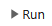 |
| 3    | Set parameter values   | 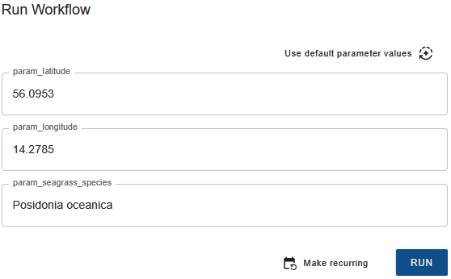 | 
| 3.1  | Fill in default values | 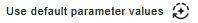
| 3.2  | Change values          | latitude, decimal degrees longitude, decimal degrees seagrass_species (One of the European seagrass names) <ul style="color:red;"><li>Cymodocea nodosa</li><li>Halophila stipulacea</li><li>Posidonia oceanica</li><li>Zostera marina</li><li>Zostera noltei</li><li>Zostera marina and Cymodocea nodosa</li><li>Zostera marina and Zostera noltei</li><li>Unspecified</li></ul> |
| 4    | Execute workflow       | 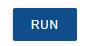 |
| 5    | Check the progress     | 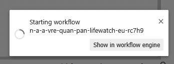 |

> Option: the details of the progress can be found by pressing `Show in workflow engine` or https://staging.demo.naavre.net/argowf/workflows, login required.

### Option 2: Run the workflow for multiple sites using **excel file** input

To execute the workflow do the following:

|      | Step | Action |
| ---- | ---- | ------ |
| 1    | Open the workflow file | open [run model from Excel upload](./workflows/run_model_from_Excel_upload.naavrewf) |
| 1.a  | <ol><li>Download the `Template-Seagrass_site_data.xlsx` by right click</li><li>Edit the `Template-Seagrass_site_data.xlsx`</li><li>Save as `Seagrass_site_data.xlsx`</li></ol> <small><ul><li>Instructions sheet: Explain the input data</li><li>Data sheet: The input data used for prediction</li></ul></small> | 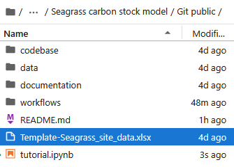 |
| 1.b  | Upload the `Seagrass_site_data.xlsx` to the `data` folder       | 1. Double click `data` folder 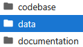   2. Click `upload` icon 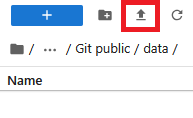   3. Successfuly uploaded  |
| 1.c  | Click `Git public` back to workspace   | 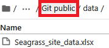 |
| 2    | Start workflow         |  |
| 3    | Set parameter values   | 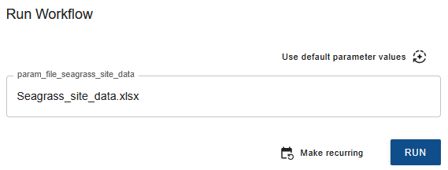 |
| 3.1  | Fill values by default | 
| 3.2  | Change file name       | Fill the uploaded excel file name `Seagrass_site_data.xlsx` |
| 4    | Execute workflow       |  |
| 5    | Check the progress     |  |

> Option: the details of the progress can be found by press `Show in workflow engine` or https://staging.demo.naavre.net/argowf/workflows, login required.

## Retrieve the output data

In the `data` folder, you should see the result files from you workflow.
* txt file: Summary of carbon stock
* csv file: Predicted carbon stock table

You can download the file by doing right click, then pressing `download`.

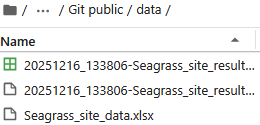
